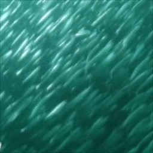
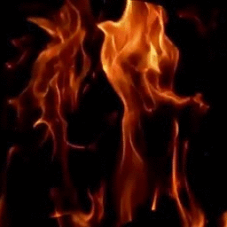
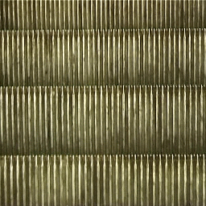
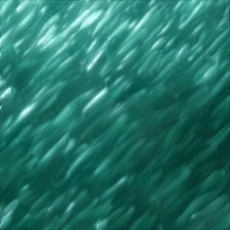
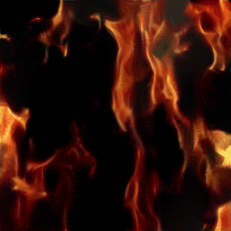
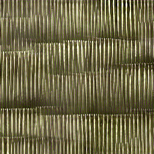

# Two-Stream Convolutional Networks for Dynamic Texture Synthesis

> This is an unofficial [**JAX**](https://github.com/google/jax) implementation of "Two-Stream Convolutional Networks for Dynamic Texture Synthesis (CVPR'18)"

Please see the author's repo [here](https://github.com/tesfaldet/two-stream-dyntex-synth) and cite them:

```bib
@inproceedings{tesfaldet2018,
  author = {Matthew Tesfaldet and Marcus A. Brubaker and Konstantinos G. Derpanis},
  title = {Two-Stream Convolutional Networks for Dynamic Texture Synthesis},
  booktitle = {IEEE Conference on Computer Vision and Pattern Recognition (CVPR)},
  year = {2018}
}
```

## Notes

We require these libraries:

```bash
pip install -U "jax[cuda]" equinox optax tqdm pillow
```

Thus far, we can **NOT** fully figure out and stick with the configurations in the official repo, but it works anyway :smile:.

We re-write the appearance / motion stream network and the proposed two-stream loss in the paper, in JAX code. Networks are built on top of [equinox](https://github.com/patrick-kidger/equinox).

## Run

```bash
python two_stream_dyntex_syn.py --exemplar_path data/fish
```

## Results

- | fish   | flames                                      | escalator                                     |
  | ------ | ------------------------------------------- | --------------------------------------------- | ------------------------------------------------ |
  | Input  |                    |            |         |
  | Output |  |  |  |
